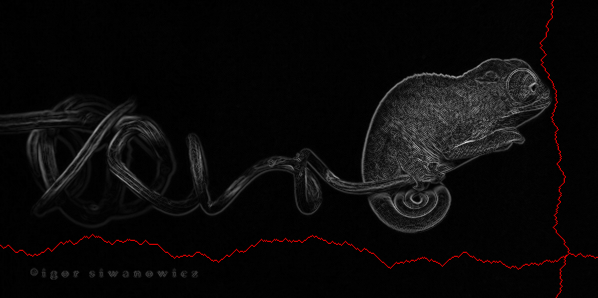
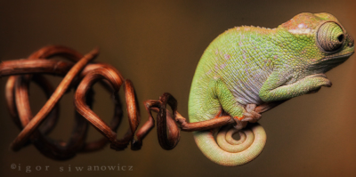

# seam-carving
Simple implementation of the Seam Carving algorithm for content-aware image resizing (https://en.wikipedia.org/wiki/Seam_carving)

Presentation on [SlideShare](https://www.slideshare.net/marcelocenerine1/seam-carving)

##### Input image (600 x 300):

##### Vertical x horizontal seams:

##### Resized image (400 x 200):

# Usage:
    scala -classpath <path to jar> seamcarving.demo.ShowSeams <image filename> <[true|false] show vertical seam> <[true|false] show horizontal seam>
    scala -classpath <path to jar> seamcarving.demo.ResizeDemo <image filename> <num cols to remove> <num rows to remove>
